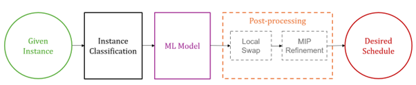

# DGSF: DeepSets-Guided Scheduling Framework

This repository contains the implementation of the **DeepSets-Guided Scheduling Framework (DGSF)** for the **single-machine non-preemptive total tardiness scheduling problem**.

---

## Framework Overview



The framework integrates machine learning with optimization-based post-processing.

---

## Repository Structure

```
Code/
    1_data_processing
    2_dgsf_main
    3_evaluation

Data/
    Input datasets (download from Google Drive)

Results/
    Experiment outputs (download from Google Drive)
```

---

## Machine Learning Component

**DeepSets_SMS_Scheduling_training.py**  
Implements the DeepSets-based machine learning model used to predict job priorities from instance features.

**Load_ML_swap.py**  
Loads a trained model and produces an initial job sequence prediction with a lightweight swap refinement.

---

## Optimization Models

**Single_machine_discrete_time.py**  
Discrete-time MIP model used to generate reference solutions.

**Solver_discrete_time.py**  
Solver script for running the discrete-time model.

**MIP_ContTime_Post_Tight.py**  
Continuous-time MIP model used for post-processing predicted schedules.

**Solver_MIP_ct_post.py**  
Solver script for the continuous-time post-processing model.

---

## Data Processing

**SMS_instance_generation.py**  
Generates synthetic scheduling instances.

**SMS_instance_classification.py**  
Computes instance-level parameters (θ, σ, δ).

**Update_input_features.py**  
Generates features required for training the ML model.

---

## Evaluation

**Schedule_evaluation.py**  
Computes evaluation metrics including optimality gap and Spearman's rank correlation.

**Feature Importance.py**  
Permutation-based feature importance analysis for the DeepSets model.

---

## Workflow

1. Generate or classify scheduling instances using `SMS_instance_generation.py` or `SMS_instance_classification.py`.
2. Compute features using `Update_input_features.py`.
3. Based on the instance characteristic from step 1, train the DeepSets model or select a pretrained model.
4. Generate predicted sequences and perform local swap using `Load_ML_swap.py`.
5. Apply MIP post-processing using `Solver_MIP_ct_post.py` to obtain final schedules.

---

## Data and Trained Models

Large datasets, trained models, and experiment outputs are available here:

**Google Drive:**  
[Download datasets and trained models](https://drive.google.com/drive/u/2/folders/1Lo8WRZabBUxGNA0nOD50TMavkKyhDwHP)

Download the files and place them in the corresponding folders:

```
Data/
Results/
```

---

## Citation

If you use this repository, please cite the associated paper.

**Paper currently under review. Citation information will be added once available.**